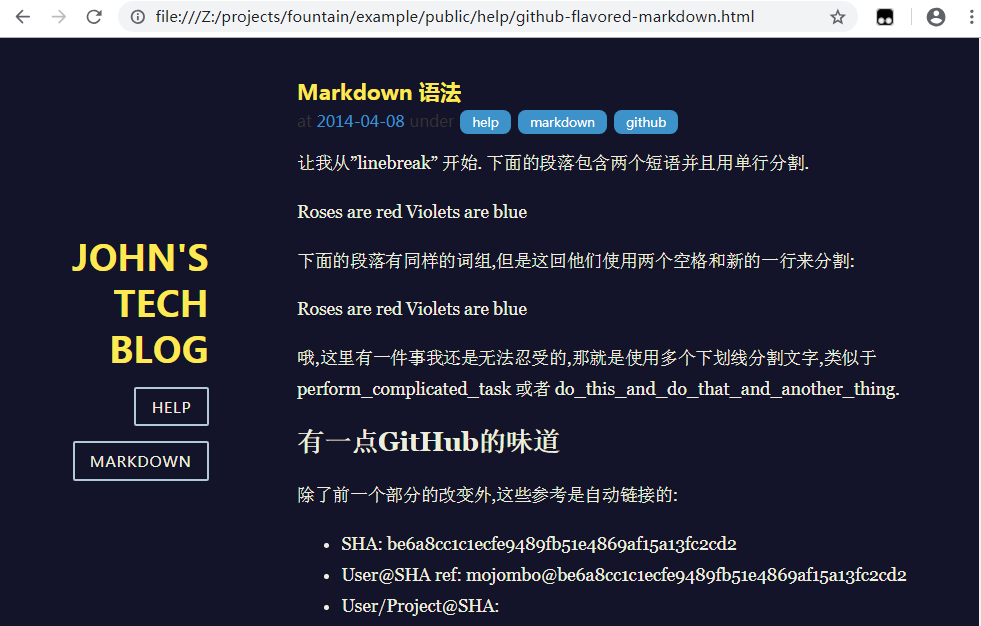

## Introduce

Fountain is an static blog generator developed by Golang.

## Usage

```
./fountain -h
fountain version: v0.6.1
Usage: fountain [-r root] [-s] [-p port] [-t theme] [-c] [-v]

Options:
  -c	清理旧输出
  -p uint
    	服务端口
  -r string
    	博客根目录
  -s	运行WEB服务
  -t string
    	皮肤主题
  -v	输出详情
 
./fountain -s -p 8080 -r example/ -t night -c -v
```

## Windows

使用下面的方法编译exe文件，复制exe文件到 examples 下双击运行，

生成 public 目录，可以直接用浏览器打开 index.html 查看网站

```
go build -ldflags "-s -w" -o fountain.exe main.go
```

## 浅色主题（默认）


## 深色主题



