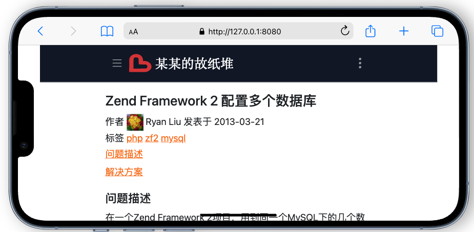

## Introduce

Fountain is an static blog generator developed by Golang.

## Usage

```
./fountain -r example/ -v -c
```

## Windows

使用下面的方法编译exe文件，复制exe文件到 examples 下双击运行，

生成 public 目录，可以直接用浏览器打开 index.html 查看网站

```
go build -ldflags "-s -w" -o fountain-win7-x64.exe
```

## 深色主题



## 浅色主题


